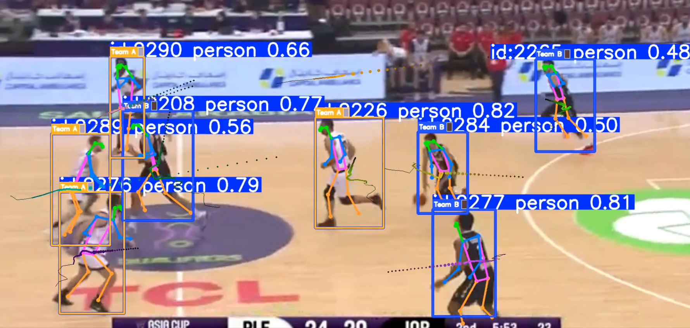

# SportVision

A sports analytics pipeline built as a portfolio project. It combines pose estimation, multi-object tracking, optical character recognition, and LLM-generated commentary into a single Streamlit web application.

The intent is to demonstrate how several independent computer vision and AI components can be composed into a cohesive, interactive tool — without custom model training.

---





## Features

| Capability | Implementation |
|---|---|
| Person detection with 17-keypoint skeleton overlay | YOLOv11-Pose (`yolo11n-pose.pt`) |
| Unsupervised team separation by jersey colour | K-Means (k=2) on per-player CIE LAB features via `cv2.kmeans`; skin-tone and shadow masking; pose keypoint–guided torso crop |
| Multi-player tracking with persistent IDs | ByteTrack, built into Ultralytics |
| Motion trail visualisation | Rolling position history drawn per track ID |
| Linear trajectory projection | Average-velocity extrapolation over a configurable frame window |
| Text extraction from jerseys and scoreboards | EasyOCR |
| Contextual sports commentary | Groq API — `llama-3.3-70b-versatile` |
| H.264 video output for browser playback | imageio-ffmpeg |

All configuration (model names, thresholds, visual parameters) lives in a single `config.py` file.

---

## How It Works

**Image pipeline.** When a user uploads an image, `yolo11n-pose.pt` runs a single forward pass that simultaneously produces bounding boxes and 17 COCO keypoints per person. Ultralytics renders the skeleton overlay automatically. Immediately after, the jersey region of each bounding box is cropped — using shoulder/hip keypoints to define the exact torso boundary when those landmarks are confident enough, falling back to a fixed-fraction window otherwise. The crop is resized to 32×32 and skin-tone pixels (via an HSV range mask) and near-black shadow pixels are excluded before a K-Means (k=1) pass in CIE LAB space extracts the dominant jersey colour. A second K-Means pass (k=2) in LAB space across all players splits them into two teams, with labels normalised by perceptual lightness (LAB L\*) for consistency. EasyOCR then scans the original image for legible text. Finally, the detection summary and OCR results are forwarded to the Groq API to produce a short commentary string.

**Video pipeline.** Each frame is passed to `yolo11n-pose.pt` via Ultralytics' `model.track()` with ByteTrack enabled (`persist=True`). This gives every detected player a consistent numeric ID across frames. A `TeamTracker` class accumulates a rolling 15-frame colour history per track ID — extracting jersey colours with the same LAB + skin-masking + keypoint-crop pipeline used for images — and re-clusters using K-Means (k=2) in LAB space to keep team assignments stable against frame-to-frame colour variation. Motion trails are drawn as fading polylines using the position history deque; trajectory projections are linear extrapolations of the average velocity over the last 6 positions. Output is encoded to H.264 via imageio-ffmpeg.

---

## Project Structure

```
sportvision/
├── app.py            # Streamlit entry point
├── config.py         # All tuneable constants — edit here, nowhere else
├── detector.py       # YOLOv11-Pose, team clustering, ByteTrack video tracking
├── ocr_reader.py     # EasyOCR wrapper
├── commentary.py     # Groq API wrapper
├── utils.py          # OpenCV drawing helpers (trails, trajectory, team overlay)
├── launch.py         # Windows launcher (patches Python 3.10 mimetypes bug)
├── requirements.txt  # pip dependencies
├── environment.yml   # Conda environment definition
└── README.md
```

---

## Setup

**1. Clone**

```bash
git clone https://github.com/YOUR_USERNAME/sportvision.git
cd sportvision
```

**2. Create and activate the Conda environment**

```bash
conda env create -f environment.yml
conda activate sport_analysis
```

**3. Set your Groq API key**

Obtain a free key at [console.groq.com](https://console.groq.com).

```powershell
# Windows PowerShell — current session only
$env:GROQ_API_KEY = "your_key_here"

# Windows — persistent across sessions
setx GROQ_API_KEY "your_key_here" (or set GROQ_API_KEY "your_key_here" for current user only)
```

```bash
# macOS / Linux
export GROQ_API_KEY="your_key_here"
```

**4. Run**

```bash
# macOS / Linux, or Windows with administrator rights
streamlit run app.py

# Windows with restricted registry access (most corporate machines)
python launch.py
```

Open `http://localhost:8501` in your browser.

> `launch.py` exists because Python 3.10 on Windows raises `PermissionError` when
> Streamlit calls `mimetypes.init()`, which tries to read `HKEY_CLASSES_ROOT`.
> The launcher patches `MimeTypes.read_windows_registry` to swallow that error
> before Streamlit initialises. This is fixed in Python 3.11.1+.

---

## Usage

**Image tab**

1. Upload a JPG, PNG, or WEBP image containing players.
2. The app runs pose estimation and team clustering automatically — no configuration needed.
3. Scroll down to view the keypoint detail table, team breakdown, and OCR results.
4. Click "Generate Commentary" to call the Groq API.

**Video tab**

1. Upload an MP4, AVI, or MOV clip. Clips under 30 seconds are recommended for quick iteration.
2. Optionally toggle motion trails and trajectory projection, or adjust trail length.
3. Processing runs frame-by-frame with a progress bar.
4. The annotated H.264 output plays in-browser and is available for download.

---

## Demo

**Image analysis**


**Video analysis**


> Screenshots to be added. Create a `docs/` folder and drop images there.

---

## Architecture

```
Input (image or video)
        |
        v
  detector.py
    yolo11n-pose.pt  →  bounding boxes + 17-keypoint skeletons
    K-Means (k=2)    →  jersey colour clustering → Team A / Team B
    ByteTrack        →  persistent player IDs across video frames
    utils.py         →  trail history, trajectory projection, team overlay
        |
        v
  ocr_reader.py
    EasyOCR          →  jersey numbers, scoreboard text
        |
        v
  commentary.py
    Groq API         →  llama-3.3-70b-versatile → commentary string
        |
        v
  app.py
    Streamlit        →  renders annotated frames, tables, and commentary
```

---

## Configuration

All constants are defined in `config.py`. The most commonly adjusted values are:

| Constant | Default | Purpose |
|---|---|---|
| `POSE_MODEL` | `yolo11n-pose.pt` | Swap for a larger model (e.g. `yolo11s-pose.pt`) for better accuracy |
| `DEFAULT_CONF` | `0.25` | Lower to detect partially occluded players; raise to reduce false positives |
| `DEFAULT_TRAIL_LEN` | `40` | Longer trails give more movement history; shorter is less cluttered |
| `TRAJECTORY_N_FRAMES` | `20` | Frames ahead to project; reduce for fast-moving scenes |
| `GROQ_MODEL` | `llama-3.3-70b-versatile` | Any Groq-supported chat model |
| `JERSEY_RESIZE` | `32` | Jersey crop resize (N×N) before K-Means — larger = more stable colour |
| `JERSEY_KP_CONF` | `0.4` | Min shoulder/hip keypoint confidence to use pose-guided torso crop |
| `JERSEY_DARK_V_MAX` | `30` | HSV V threshold below which pixels are treated as shadow/background |

---

## Tech Stack

| Layer | Library / Model |
|---|---|
| UI | Streamlit |
| Pose estimation and detection | Ultralytics YOLOv11 (`yolo11n-pose.pt`) |
| Team clustering | OpenCV `cv2.kmeans` in CIE LAB space; HSV skin-tone masking; pose keypoint–guided crop |
| Multi-object tracking | ByteTrack via Ultralytics |
| Visual overlays | OpenCV |
| Text recognition | EasyOCR |
| LLM commentary | Groq API (`llama-3.3-70b-versatile`) |
| Video encoding | imageio-ffmpeg (libx264 H.264) |
| Runtime | Python 3.10, PyTorch |

---

## License

MIT
